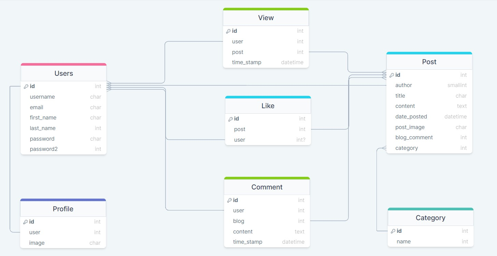
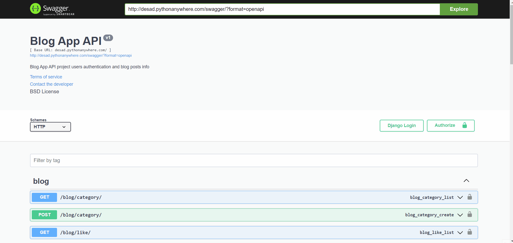

<h1 align="center">Full Stack - Blog App - Backend</h1>

<div align="center">
  <h3>
    <a href="https://desad.pythonanywhere.com/">
      Project Link
    </a>
  </h3>
</div>

<!-- TABLE OF CONTENTS -->

## Table of Contents

- [Overview](#overview)
- [Project Info](#projectinfo)
- [Entity Relationship Diagram](#entity-relationship-diagram)
- [Project Link](#project-link)
- [Preview](#preview-of-the-project)
- [Built With](#built-with)
- [Project Structure](#project-structure)
- [How to use](#how-to-use)
- [Contact](#contact)

## Overview

- This is the backend side of my Full Stack Blog App project.
- I used reactjs for frontend.
  ##### You can see the frontend side of this project from [here](https://github.com/esadakman/fs-reactjs-blog-app) 👈

## Project Info

<ul>
    <li>User and Blog tables are interconnected and each user has its own profile.</li>
    <li>Users can update their user information and profile picture by coming to the profile section.</li>
    <li>Users who have logged into the system can create, edit and delete their own posts.</li>
    <li>In addition to creating your own posts, you can comment or like your own posts and other users' posts.</li> 
    <li>I did construct this structure using a generic view. In order to override Class methods, i did provide a if-else structures that should act accordingly whether the person is a authenticated or not. I did use IsAuthenticated from Rest framework permissions, IsAuthorOrReadOnly and IsAdminOrReadOnly from my custom permissions file.</li>
    <li>I used django filters for searching posts and filtering user's own posts .</li>
    <li>I used nested serializer and method fields in my serializers.</li>
    <li>I used the cors-headers package to connect the frontend to my API.</li>
</ul> 

<!-- ERD -->

## Entity Relationship Diagram



 <!-- OVERVIEW -->

## Project Link

#### You can reach my project from [here](https://desad.pythonanywhere.com/) 👈

## Preview of the Project



### Built With

<!-- This section should list any major frameworks that you built your project using. Here are a few examples.-->

- Django
- Django Rest Framework
- Django Rest Auth
- Django Rest Authtoken
- Django Filter
- Django Cors Headers
- Swagger

## Project Structure

```bash
.──── fs-django-blog-app-drf (repo)
│
├── main
│     ├── __pycache__
│     ├── __init__.py
│     ├── asgi.py
│     ├── urls.py
│     ├── wsgi.py
│     └── settings.py
│─── blog
│       ├── __pycache__
│       ├── migrations
│       ├── __init__.py
│       ├── admin.py
│       ├── apps.py
│       ├── models.py
│       ├── pagination.py
│       ├── permissions.py
│       ├── serializers.py
│       ├── signals.py
│       ├── tests.py
│       ├── urls.py
│       └── views.py
├──── users
│       ├── __pycache__
│       ├── migrations
│       ├── __init__.py
│       ├── admin.py
│       ├── apps.py
│       ├── models.py
│       ├── serializers.py
│       ├── signals.py
│       ├── tests.py
│       ├── urls.py
│       └── views.py
├── .env
├── .gitignore
├── db.sqlite3
├── drf-blog-erd.jpg
├── manage.py 
├── README.md 
└── requirements.txt

```

## How To Use

To clone and run this application, you'll need [Git](https://git-scm.com)

```bash
# Clone this repository
$ git clone https://github.com/esadakman/fs-django-blog-app-drf

# Install dependencies
    $ py -m venv env
    > env/Scripts/activate (for win OS)
    $ source env/bin/activate (for macOs/linux OS)
    $ pip install -r requirements.txt


# Add .env file for secret key and set your secret_key

- Create a .env file for =>
  -- SECRET_KEY,

- After these you can run the project as usual =>
    $ py manage.py migrate
    $ py manage.py createsuperuser

# Run the app
    $ python manage.py runserver
```

## Contact

- Website [@esadakman](https://esadakman.github.io/)
- GitHub [@esadakman](https://github.com/esadakman)
- Linkedin [@esadakman](https://www.linkedin.com/in/esadakman/)


